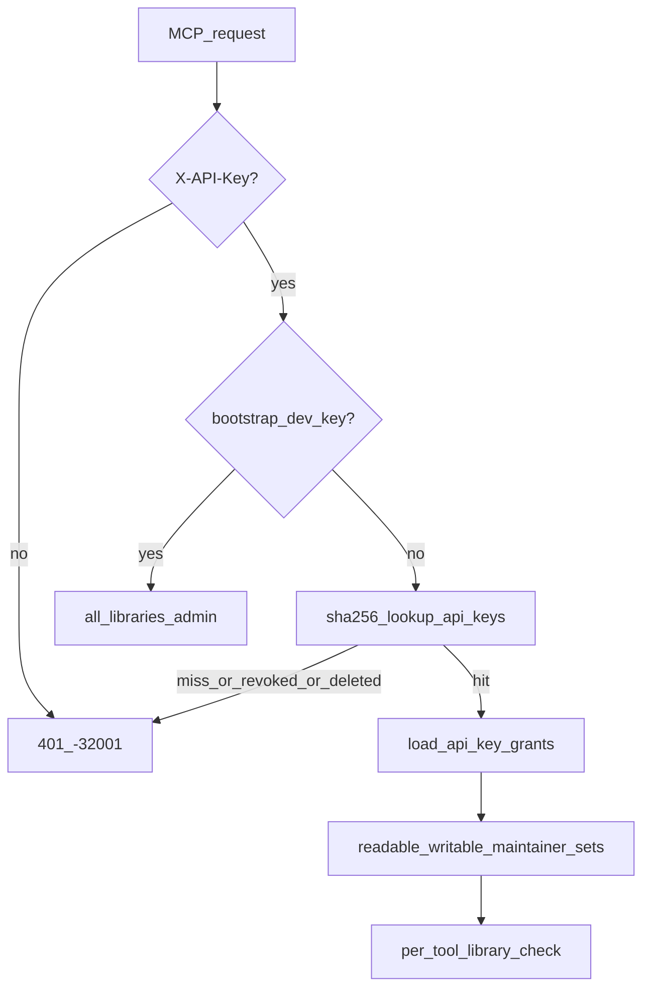

# 08 — Knowledge Base Access & Organization Isolation

> Chinese version: [authorization-and-libraries.zh.md](authorization-and-libraries.zh.md)

> **ADR**: [ADR-011](../02-architecture/decisions/011-kb-access-and-org-isolation.md)
> **Status**: Design finalized; the v1 implementation of key issuance/lifecycle is authoritative in [13-self-service-onboarding.md](../05-agent/getting-started.md) and [14-api-key-lifecycle.md](../04-frontend/api-keys-ui-and-api.md)

---

## 1. Goals

| Goal | Description |
|------|------|
| **Mandatory keys** | All agent access to any library (including public libraries) requires a valid API key; **anonymous MCP reads are removed** |
| **Contribution first** | No grant on a library = no access; having a grant defaults to **read + write** |
| **Paid read-only** | Only paid plans can create **read-only** grants (see [ADR-012](../02-architecture/decisions/012-billing-and-quotas.md), [09](billing-and-quotas.md)) |
| **Org isolation** | Orgs own libraries; membership is many-to-many; visibility controls entitlement |
| **Key issuance** | Users self-issue keys via the user portal (Authing session); MCP key-issuance tools deferred to v1.1 |

---

## 2. Conceptual model

### 2.1 Entities

```text
Organization ──< org_members >── Principal (user:xxx)
      │
      └──< libraries (org_id = owner org)
                │
                ├── visibility: public | org | private
                └── library_grants ──> Principal (explicit external grant)

Principal ──< api_keys ──< api_key_grants >── Library
```

### 2.2 Terminology

| Term | Meaning |
|------|------|
| **Principal** | An identity subject, e.g. `user:<authing_sub>`; registered in the `principals` table |
| **Entitlement** | Layer 1: whether a principal *is allowed* to touch a library (determined by visibility + membership + library_grants) |
| **Key grant** | Layer 2: the **read / write / maintain** capability subset an API key has on a library |
| **Public library** | `lib_default` (Community Library), `visibility=public` |
| **Personal library** | `kind=personal`, `owner_principal_id` points to the user; named `{display_name}'s Personal Library` ([10](writes-audit-and-deletion.md) §3) |
| **Org library** | `org_id` points to the owning org; defaults to `visibility=org` |

### 2.3 Two-layer authorization

**Layer 1 — Entitlement resolution** (when creating a key or validating a grant subset)

```python
def entitled_libraries(principal_id: str) -> dict[str, LibraryEntitlement]:
    """
    library_id -> { can_read, can_write, can_maintain }
    Union of:
      - public libraries (any authenticated principal: read+write entitlement)
      - personal library (owner)
      - org libraries where principal in org_members
      - library_grants rows for this principal
    Org admin on org library -> can_maintain on that library.
    """
```

**Layer 2 — Effective key capabilities** (per MCP request)

```python
def effective_capabilities(key_id: str) -> KeyCapabilities:
    readable   = { lib | api_key_grants row exists }
    writable   = { lib | row.role == 'writer' }
    maintainer = { lib | row.role == 'maintainer' AND owner has maintain entitlement }
```

**Invariant**: key grants must be a **subset** of the owner's entitlement; a read-only grant (reader) is allowed only if the key's plan permits it (`allow_readonly_grants`, see 09).

---

## 3. Data model (as implemented)

### `organizations`

`id, name, entitlement (free|paid), created_at` (billing extensions in [09](billing-and-quotas.md) §3.6)

### `libraries`

`id, org_id (owner org), name, visibility (public|org|private), kind (personal|…), owner_principal_id, created_by, created_at, write_buffer_hours (DEFAULT 24, see design/16)`

**Seed**: `lib_default` → `visibility=public`, `org_id=org_default`, name=`Community Library`.

### `principals`

`id, kind, display_name, display_name_locked (design/17), entitlement, sso_user, created_at, metadata_json`

### `org_members`

```sql
CREATE TABLE org_members (
  org_id TEXT NOT NULL,
  principal_id TEXT NOT NULL,
  role TEXT NOT NULL CHECK (role IN ('admin', 'member')),
  created_at TEXT NOT NULL,
  PRIMARY KEY (org_id, principal_id)
);
```

### `api_keys`

```sql
CREATE TABLE api_keys (
  key_id TEXT PRIMARY KEY,
  key_hash TEXT NOT NULL UNIQUE,      -- sha256(plaintext)
  principal_id TEXT NOT NULL,
  label TEXT NOT NULL DEFAULT '',
  created_at TEXT NOT NULL,
  created_by TEXT,
  last_used_at TEXT,
  expires_at TEXT,
  revoked_at TEXT,                    -- legacy/admin rows only; self-service keys use hard delete (design/14)
  key_prefix TEXT,                    -- first 12 plaintext characters, display only
  key_ciphertext TEXT                 -- Fernet-encrypted plaintext, owner can re-reveal it (design/14)
);
```

- Plaintext format `ma3k_<random>`; validated via hash, ciphertext is only for the owner to copy again in the UI
- **The lifecycle of a self-service key is deletion (hard delete), not revocation**; `revoked_at` is only kept for legacy rows (no longer appears in listings, does not count against quota)

### `api_key_grants`

```sql
CREATE TABLE api_key_grants (
  key_id TEXT NOT NULL,
  library_id TEXT NOT NULL,
  role TEXT NOT NULL,                 -- reader | writer
  PRIMARY KEY (key_id, library_id)
);
```

### `library_grants`

```sql
CREATE TABLE library_grants (
  library_id TEXT NOT NULL,
  principal_id TEXT NOT NULL,
  role TEXT NOT NULL CHECK (role IN ('contributor', 'maintainer', 'admin')),
  created_at TEXT NOT NULL,
  PRIMARY KEY (library_id, principal_id)
);
```

Used for explicit grants to an external principal on a **private** library or an org.

---

## 4. Rules in detail

### 4.1 Read + Write coupling (contribution first)

When creating or updating a key grant:

```text
IF grant.library_id is not in owner entitled_libraries:  REJECT 403 / 400
IF grant.role == reader:
    IF NOT plan.allow_readonly_grants:  reject (free tier Community writer lock, see design/14)
```

**Product semantics**: a free user granting a key read access to the public library ⇒ **must also grant write**; "read-only extraction" requires a paid plan or joining a paid org.

### 4.2 Visibility & entitlement

| visibility | entitled principals |
|------------|---------------------|
| `public` | All authenticated principals (read+write; maintain only for platform admin / `library_grants.admin`) |
| `org` | Members of the owner org's `org_members`; admin members also get maintain |
| `private` | Owner (personal library) or a `library_grants` row |

### 4.3 Maintain capability

A maintainer grant requires: writer capability + owner has maintain entitlement on that library. Used to gate `ma3_list_drafts`, `ma3_review_record`, `supersedes`, and similar maintainer operations.

### 4.4 MCP request resolution



- **Bootstrap dev key**: `MA3_DEV_AUTH=1` combined with a matching `MA3_DEV_API_KEY` → admin bypass (LAN only)
- **Bearer / session grants no MCP data access**: session is used only for UI and key management

### 4.5 Write-path library selection

`ma3_report`: `library_id` is optional; defaults to **the owner's personal library** (`default_owned_personal_library`); the response echoes back `library_selection_reason`. verify/refute follow the library of the `target_record_id`. See [10](writes-audit-and-deletion.md) §2 and [13](../05-agent/getting-started.md) §10 for details.

---

## 5. Key management UI

**v1 implementation source of truth**: [13-self-service-onboarding.md](../05-agent/getting-started.md) (issuance) + [14-api-key-lifecycle.md](../04-frontend/api-keys-ui-and-api.md) (lifecycle). Highlights:

- `/ui/keys/` (Authing session): list, create (grant picker: personal + Community, free tier Community writer lock), copy (ciphertext re-reveal), rename, **delete**
- REST: `GET/POST /api/keys`, `PATCH /api/keys/{key_id}` (label), `DELETE /api/keys/{key_id}`; mutating routes require same-origin
- **MCP key-issuance tools (`ma3_create_key`, etc.) deferred to v1.1**: to avoid a persistence attack surface for leaked-key permissions; bootstrap scenarios inherently require a human to use the UI anyway
- Org admin pages (`/ui/orgs/*`) are v1.1

### `ma3_whoami` response

```json
{
  "principal_id": "user:abc",
  "display_name": "Zhang San",
  "writable_libraries": [
    {"library_id": "lib_personal_abc", "name": "Zhang San's Personal Library", "visibility": "private"},
    {"library_id": "lib_default", "name": "Community Library", "visibility": "public"}
  ],
  "effective": {"readable": ["…"], "writable": ["…"], "maintainer": []}
}
```

---

## 6. `ma3_doctor` and security

- Doctor report: `anonymous_mcp_enabled: false`, `api_keys_table: ok`, legacy env writer keys deprecated
- `MA3_WRITER_API_KEYS` / `MA3_MAINTAINER_API_KEYS` are deprecated; a startup warning is emitted if they are set

| Item | Measure |
|----|------|
| Key storage | SHA-256 hash validation + Fernet ciphertext (owner re-reveal); hash/ciphertext never appear in listing responses |
| Key transport | HTTPS; `X-API-Key` header |
| Invalidation | Row deletion (self-service) or `revoked_at` (legacy) both result in rejection |
| Audit | Creation/deletion/grant changes are written to the application log; write auditing is described in [10](writes-audit-and-deletion.md) |
| Privilege-escalation probing | Another user's key_id / record → **404**, does not leak existence |

---

## 7. Open items for v1.1

| Item | Description |
|----|------|
| `ma3_create_key` / `ma3_list_keys` / MCP issuance | Constraint: grants ⊆ caller's key grants; owner is the same principal; dev bypass disabled |
| Full entitlement resolver implementation | Replace the v1 heuristic (personal ∪ lib_default ∪ active key grants) |
| Org admin UI (`/ui/orgs/*`) | Members, library creation, visibility, external grants |
| Key rotation / expiry UI | The `expires_at` column already exists |
| `entitlement` field → `billing_account.plan_code` | [09](billing-and-quotas.md) |

---

## 8. Related documents

| Document | Relationship |
|------|------|
| [ADR-011](../02-architecture/decisions/011-kb-access-and-org-isolation.md) | Access control decisions |
| [09-billing-and-quotas.md](billing-and-quotas.md) | Paid plans and quotas |
| [10-write-audit-and-delete.md](writes-audit-and-deletion.md) | Write auditing and deletion |
| [13-self-service-onboarding.md](../05-agent/getting-started.md) | Self-service registration and key issuance (v1 implementation) |
| [14-api-key-lifecycle.md](../04-frontend/api-keys-ui-and-api.md) | Key lifecycle (v1 implementation) |
| [15-user-portal.md](../04-frontend/portal-permissions.md) | UI-side Stats/Enumerate/Mutate three-tier capabilities |
