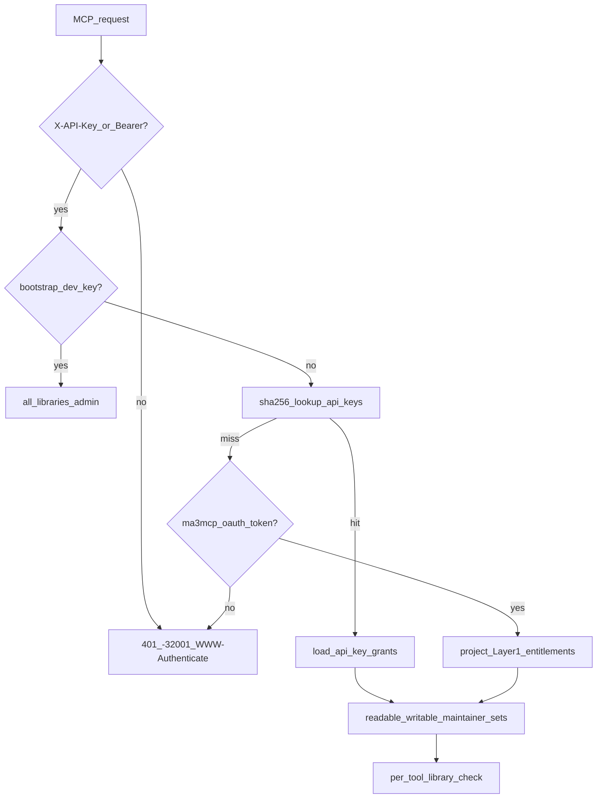

# 08 — 知识库访问与组织隔离

> **ADR**：[ADR-011](../02-architecture/decisions/011-kb-access-and-org-isolation.md)  
> **状态**：设计定稿；key 签发/生命周期的 v1 实现以 [13-self-service-onboarding.md](../05-agent/getting-started.md)、[14-api-key-lifecycle.md](../04-frontend/api-keys-ui-and-api.md) 为准

---

## 1. 目标

| 目标 | 说明 |
|------|------|
| **强制凭证** | 所有 Agent 访问任何 library（含公共库）须持有效 **API key** 或 **ma3 MCP OAuth token**；**移除匿名 MCP 读** |
| **贡献优先** | 对 library 无 grant = 无访问；有 grant 默认 **read + write** |
| **付费 read-only** | 仅付费 plan 可创建 **只读** grant（见 [ADR-012](../02-architecture/decisions/012-billing-and-quotas.md)、[09](billing-and-quotas.md)） |
| **组织隔离** | org 拥有 library；成员多对多；visibility 控制 entitlement |
| **可签发 key** | 用户门户（Authing session）自助签发 key；MCP 签发工具缓期 v1.1 |
| **交互式 OAuth** | Cursor 等客户端走 MCP Authorization Spec OAuth（ADR-016）；权限 = Layer-1 entitlement |

---

## 2. 概念模型

### 2.1 实体

```text
Organization ──< org_members >── Principal (user:xxx)
      │
      └──< libraries (org_id = owner org)
                │
                ├── visibility: public | org | private
                └── library_grants ──> Principal (外部显式授权)

Principal ──< api_keys ──< api_key_grants >── Library
```

### 2.2 术语

| 术语 | 含义 |
|------|------|
| **Principal** | 身份主体，如 `user:<authing_sub>`；registry 在 `principals` 表 |
| **Entitlement** | Layer 1：某 principal *被允许* 接触某 library（由 visibility + membership + library_grants 决定） |
| **Key grant** | Layer 2：某 API key 对某 library 的 **read / write / maintain** 能力子集 |
| **Public library** | `lib_default`（Community Library），`visibility=public` |
| **Personal library** | `kind=personal`，`owner_principal_id` 指向用户；名为 `{display_name} 的个人库`（[10](writes-audit-and-deletion.md) §3） |
| **Org library** | `org_id` 指向创建 org；默认 `visibility=org` |

### 2.3 双层授权

**Layer 1 — Entitlement 解析**（创建 key 或校验 grant 子集时）

```python
def entitled_libraries(principal_id: str) -> dict[str, LibraryEntitlement]:
    """
    library_id -> { can_read, can_write, can_maintain }
    Union of:
      - public libraries (any authenticated principal: read+write entitlement)
      - personal library (owner)
      - org libraries where principal in org_members
      - library_grants rows for this principal
    Org admin on org library -> can_maintain on that library.
    """
```

**Layer 2 — Key 生效能力**（每个 MCP 请求）

```python
def effective_capabilities(key_id: str) -> KeyCapabilities:
    readable   = { lib | api_key_grants row exists }
    writable   = { lib | row.role == 'writer' }
    maintainer = { lib | row.role == 'maintainer' AND owner has maintain entitlement }
```

**Invariant**：key grants 必须是 owner entitlement 的**子集**；只读 grant（reader）仅当 key 对应 plan 允许（`allow_readonly_grants`，见 09）。

---

## 3. 数据模型（已落库形态）

### `organizations`

`id, name, entitlement (free|paid), created_at`（billing 扩展见 [09](billing-and-quotas.md) §3.6）

### `libraries`

`id, org_id (owner org), name, visibility (public|org|private), kind (personal|…), owner_principal_id, created_by, created_at, write_buffer_hours (DEFAULT 24, 见 design/16)`

**Seed**：`lib_default` → `visibility=public`，`org_id=org_default`，name=`Community Library`。

### `principals`

`id, kind, display_name, display_name_locked (design/17), entitlement, sso_user, created_at, metadata_json`

### `org_members`

```sql
CREATE TABLE org_members (
  org_id TEXT NOT NULL,
  principal_id TEXT NOT NULL,
  role TEXT NOT NULL CHECK (role IN ('admin', 'member')),
  created_at TEXT NOT NULL,
  PRIMARY KEY (org_id, principal_id)
);
```

### `api_keys`

```sql
CREATE TABLE api_keys (
  key_id TEXT PRIMARY KEY,
  key_hash TEXT NOT NULL UNIQUE,      -- sha256(plaintext)
  principal_id TEXT NOT NULL,
  label TEXT NOT NULL DEFAULT '',
  created_at TEXT NOT NULL,
  created_by TEXT,
  last_used_at TEXT,
  expires_at TEXT,
  revoked_at TEXT,                    -- 仅 legacy/admin 行；自助 key 用硬删除（design/14）
  key_prefix TEXT,                    -- 明文前 12 字符，仅展示
  key_ciphertext TEXT                 -- Fernet 加密明文，owner 可重复展示（design/14）
);
```

- 明文格式 `ma3k_<random>`；hash 校验，ciphertext 仅供 owner 在 UI 复制
- **自助 key 的生命周期是删除（hard delete），不是撤销**；`revoked_at` 仅保留给 legacy 行（不再出现在列表、不参与配额）

### `api_key_grants`

```sql
CREATE TABLE api_key_grants (
  key_id TEXT NOT NULL,
  library_id TEXT NOT NULL,
  role TEXT NOT NULL,                 -- reader | writer
  PRIMARY KEY (key_id, library_id)
);
```

### `library_grants`

```sql
CREATE TABLE library_grants (
  library_id TEXT NOT NULL,
  principal_id TEXT NOT NULL,
  role TEXT NOT NULL CHECK (role IN ('contributor', 'maintainer', 'admin')),
  created_at TEXT NOT NULL,
  PRIMARY KEY (library_id, principal_id)
);
```

用于 **private** library 或 org 对外部 principal 的显式授权。

---

## 4. 规则详解

### 4.1 Read + Write 耦合（贡献优先）

创建或更新 key grant 时：

```text
IF grant.library_id 不在 owner entitled_libraries:  REJECT 403 / 400
IF grant.role == reader:
    IF NOT plan.allow_readonly_grants:  拒绝（免费档 Community writer 锁定，见 design/14）
```

**产品语义**：免费用户给 key 授权公共库读 ⇒ **必须同时写**；要「只读汲取」须付费或加入付费 org。

### 4.2 Visibility 与 Entitlement

| visibility | entitled principals |
|------------|---------------------|
| `public` | 所有已认证 principal（read+write；maintain 仅 platform admin / library_grants.admin） |
| `org` | owner org 的 `org_members` 成员；admin 成员 +maintain |
| `private` | owner（personal 库）或 `library_grants` 行 |

### 4.3 Maintain 能力

maintainer grant 要求：writer 能力 + owner 对该库有 maintain entitlement。用于 `ma3_list_drafts`、`ma3_review_record`、`supersedes` 等 maintainer 门控。

### 4.4 MCP 请求解析



- **Bootstrap dev key**：`MA3_DEV_AUTH=1` 且匹配 `MA3_DEV_API_KEY` → admin bypass（LAN only）
- **API key**：Layer-2 `api_key_grants`（Agent/CI 主路径）
- **MCP OAuth token**：登录主体的 Layer-1 entitlement 投影（ADR-016）
- **裸 Authing Bearer / session cookie**：不是 MCP 数据凭证（session 仅用于 UI + OAuth authorize）

### 4.5 写路径 library 选择

`ma3_report`：可选 `library_id`；缺省 → **owner 的 personal library**（`default_owned_personal_library`）；响应回显 `library_selection_reason`。verify/refute 跟随 `target_record_id` 所在库。详见 [10](writes-audit-and-deletion.md) §2、[13](../05-agent/getting-started.md) §10。

---

## 5. Key 管理界面

**v1 实现真源**：[13-self-service-onboarding.md](../05-agent/getting-started.md)（签发）+ [14-api-key-lifecycle.md](../04-frontend/api-keys-ui-and-api.md)（生命周期）。要点：

- `/ui/keys/`（Authing session）：列表、创建（grant picker：personal + Community，free 档 Community writer 锁定）、复制（ciphertext 重展示）、改名、**删除**
- REST：`GET/POST /api/keys`、`PATCH /api/keys/{key_id}`（label）、`DELETE /api/keys/{key_id}`；mutating 路由须 same-origin
- **MCP 签发工具（`ma3_create_key` 等）缓期 v1.1**：防泄漏 key 的权限持久化攻击面；自举场景本来就需要人操作 UI
- org 管理页（`/ui/orgs/*`）v1.1

### `ma3_whoami` 返回

```json
{
  "principal_id": "user:abc",
  "display_name": "张三",
  "writable_libraries": [
    {"library_id": "lib_personal_abc", "name": "张三 的个人库", "visibility": "private"},
    {"library_id": "lib_default", "name": "Community Library", "visibility": "public"}
  ],
  "effective": {"readable": ["…"], "writable": ["…"], "maintainer": []}
}
```

---

## 6. `ma3_doctor` 与安全

- doctor 报告：`anonymous_mcp_enabled: false`、`api_keys_table: ok`、legacy env writer keys deprecated
- `MA3_WRITER_API_KEYS` / `MA3_MAINTAINER_API_KEYS` 已 deprecated；设置时启动 warn

| 项 | 措施 |
|----|------|
| Key 存储 | SHA-256 hash 校验 + Fernet ciphertext（owner 重展示）；hash/ciphertext 永不出现在列表响应 |
| Key 传输 | HTTPS；`X-API-Key` header |
| 失效 | 行删除（自助）或 `revoked_at`（legacy）即拒绝 |
| 审计 | 创建/删除/grant 变更写 application log；写入审计见 [10](writes-audit-and-deletion.md) |
| 越权探测 | 他人 key_id / record → **404**，不泄露存在性 |

---

## 7. v1.1 开放项

| 项 | 说明 |
|----|------|
| `ma3_create_key` / `ma3_list_keys` / MCP 签发 | 约束：grants ⊆ 调用者 key grants；owner 同 principal；dev bypass 禁用 |
| entitlement resolver 完整实现 | 替换 v1 启发式（personal ∪ lib_default ∪ active key grants） |
| org 管理 UI（`/ui/orgs/*`） | 成员、建库、visibility、外部 grant |
| Key 轮换 / 过期 UI | `expires_at` 列已在 |
| `entitlement` 字段 → `billing_account.plan_code` | [09](billing-and-quotas.md) |

---

## 8. 相关文档

| 文档 | 关系 |
|------|------|
| [ADR-011](../02-architecture/decisions/011-kb-access-and-org-isolation.md) | 访问控制决策 |
| [09-billing-and-quotas.md](billing-and-quotas.md) | 付费套餐与配额 |
| [10-write-audit-and-delete.md](writes-audit-and-deletion.md) | 写入审计与删除 |
| [13-self-service-onboarding.md](../05-agent/getting-started.md) | 自助注册与 key 签发（v1 实现） |
| [14-api-key-lifecycle.md](../04-frontend/api-keys-ui-and-api.md) | key 生命周期（v1 实现） |
| [15-user-portal.md](../04-frontend/portal-permissions.md) | UI 侧 Stats/Enumerate/Mutate 三级能力 |
