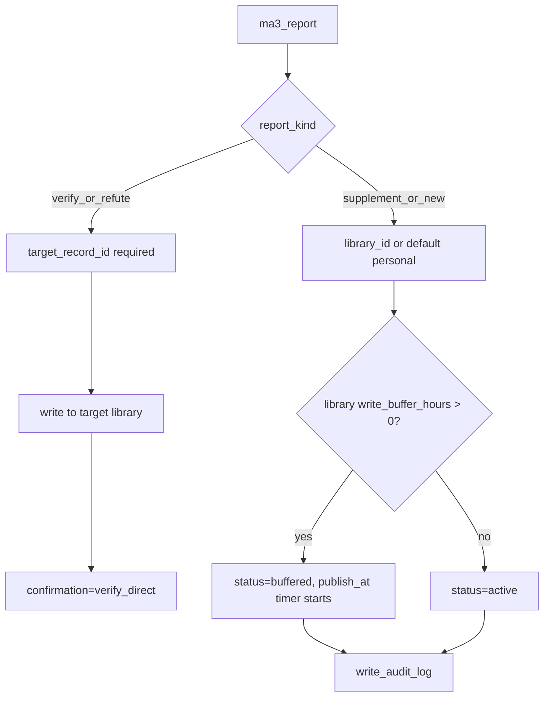

# 10 — Write Confirmation, Audit & Deletion

> Chinese version: [writes-audit-and-deletion.zh.md](writes-audit-and-deletion.zh.md)

> **ADR**: [ADR-013](../02-architecture/decisions/013-write-confirmation-audit-delete.md)
> **Prerequisites**: [08-kb-access](authorization-and-libraries.md), [09-billing](billing-and-quotas.md)
> **Status**: Design finalized; `confirmation` semantics revised per [13](../05-agent/getting-started.md) §10 (omitting it is no longer a 400); publish timing described in [16-library-write-buffer.md](write-buffer.md)

---

## 1. Write decision tree



---

## 2. `ma3_report` extended fields

| Field | Required | Description |
|------|------|------|
| `report_kind` | No (defaults to new/supplement path) | `verify` \| `refute` \| `supplement` \| `new` |
| `target_record_id` | Required for verify/refute | The record being verified/refuted |
| `library_id` | Optional for supplement/new | Defaults to the user's personal library |
| `confirmation` | **Optional, defaults to `agent_judged`** | `user_confirmed` \| `agent_judged`; verify/refute auto-set to `verify_direct`. **Audit metadata, not a gate** — the schema description explicitly tells the agent not to stop and ask the user for confirmation because of this |

**Validation**:

```python
if report_kind in ("verify", "refute"):
    assert target_record_id
    library_id = get_record(target_record_id).library_id
    assert key_can_read(library_id)
    confirmation = "verify_direct"
else:
    confirmation = confirmation or "agent_judged"   # omitting it is not a 400
    library_id = library_id or default_personal_library(owner)
    assert key_can_write(library_id)
```

**The response echoes back `library_selection_reason`**:

| Branch | reason |
|------|--------|
| verify/refute follows the target record's library | `verify_target_library` |
| Payload explicitly sets `library_id` | `explicit_library_id` |
| DB key defaults to writing to the personal library | `default_owned_personal_library` |
| Legacy/dev bypass goes to `lib_default` | `legacy_default_library` |

---

## 3. Library naming

| Library | Default name |
|----|-----------|
| personal | `{display_name}'s Personal Library` (`ensure_personal_library` stays in sync with the display name, see [17](../04-frontend/display-name-registration.md)) |
| public (`lib_default`) | `Community Library` |
| org | Specified by admin at creation |

`ma3_whoami` returns `writable_libraries[]` (including name, visibility), so the agent can pick a library by name.

---

## 4. Schema

### `write_audit_log`

```sql
CREATE TABLE write_audit_log (
  id TEXT PRIMARY KEY,
  record_id TEXT NOT NULL,
  library_id TEXT NOT NULL,
  principal_id TEXT NOT NULL,
  api_key_id TEXT NOT NULL,
  report_kind TEXT NOT NULL,
  confirmation TEXT NOT NULL,
  created_at TEXT NOT NULL
);
CREATE INDEX idx_write_audit_principal ON write_audit_log (principal_id, created_at DESC);
```

- **`write_audit_log.principal_id` is the authoritative determination of "the writer"** (buffer owner operations and deletion permissions are both based on this); `records.created_by` stays in sync with it.
- `api_key_id` is a historical string, **with no foreign key**: after a key is hard-deleted, the audit row retains the original id ([14](../04-frontend/api-keys-ui-and-api.md) §3).

### `record_deletions` (tombstone)

```sql
CREATE TABLE record_deletions (
  record_id TEXT PRIMARY KEY,
  library_id TEXT NOT NULL,
  deleted_by TEXT NOT NULL,
  deleted_at TEXT NOT NULL
);
```

### `record_relations` extension

| Column | Description |
|----|------|
| `source_deleted` | INTEGER 0/1; set to 1 when the target or source is deleted |

---

## 5. `ma3_list_my_writes`

```json
{
  "writes": [
    {
      "created_at": "2026-07-03T10:00:00Z",
      "record_id": "vk_abc",
      "library_id": "lib_default",
      "library_name": "Community Library",
      "report_kind": "new",
      "confirmation": "agent_judged",
      "status": "buffered",
      "publish_at": "2026-07-04T10:00:00Z",
      "key_prefix": "ma3k_abcd"
    }
  ]
}
```

Corresponding portal page: `/ui/me/writes/` ([22-user-portal-ui-layout.md](../04-frontend/information-architecture.md) §3.4).

---

## 6. `ma3_delete_record`

**Permission**: `write_audit_log` (or `records.created_by`) must match the caller.

**Branch: whether the library has `deletion_protection` enabled**

```python
lib = get_library(record.library_id)
if lib.deletion_protection:      # only org libraries on a Team plan can enable this
    soft_delete(record)          # status=trashed, removed from search, trashed_at recorded
else:
    hard_delete(record)          # physically removed + tombstone
```

**Hard delete steps** (default / Free / personal / public):

1. Validate owner
2. `DELETE FROM records WHERE id = ?`
3. Remove index / embedding
4. `INSERT record_deletions`
5. `UPDATE record_relations SET source_deleted=1 WHERE target_id=? OR source_id=?`
6. **Does not** delete downstream records

**Soft delete steps** (`deletion_protection=1`):

1. Validate owner or org maintainer
2. `UPDATE records SET status='trashed', trashed_at=now WHERE id=?`
3. Remove from the search index (payload retained)
4. A background job converts it to a hard delete once it expires (`trashed_at + retention_days`)

**Read path**: `lineage_warnings` adds:

```text
record {rid} builds on {ref_id} which was deleted by owner
```

### `ma3_restore_record` (paid accidental-deletion protection)

- **Prerequisite**: record `status='trashed'` and its library has `deletion_protection=1`
- **Permission**: owner or org maintainer
- **Steps**: `UPDATE records SET status='active', trashed_at=NULL` + rebuild index/embedding
- If the window has expired and it's already hard-deleted → unrecoverable, returns `already_purged`

### Schema increment

| Object | Change |
|------|------|
| `libraries.deletion_protection` | INTEGER 0/1; only libraries owned by a Team plan can set to 1 |
| `libraries.retention_days` | Default 30 |
| `records.status` | Adds a `trashed` value (`buffered` covered in design/16) |
| `records.trashed_at` | TEXT nullable |
| `plans.deletion_protection` | Free/Pro=0, Team=1 ([09](billing-and-quotas.md)) |

---

## 7. MCP tools

| Tool | Description |
|------|------|
| `ma3_list_my_writes` | `limit`, `offset`; audit list (includes status/publish_at) |
| `ma3_delete_record` | `record_id`; owner delete (hard delete by default; soft delete for protected libraries); buffered records can also be deleted |
| `ma3_restore_record` | `record_id`; only restorable within the window for protected libraries |
| `ma3_publish_record` | Early publish for buffered records (see [16](write-buffer.md)) |

---

## 8. Related documents

- [ADR-013](../02-architecture/decisions/013-write-confirmation-audit-delete.md)
- [08-kb-access-and-org-isolation.md](authorization-and-libraries.md)
- [16-library-write-buffer.md](write-buffer.md)
- [13-self-service-onboarding.md](../05-agent/getting-started.md) §10
