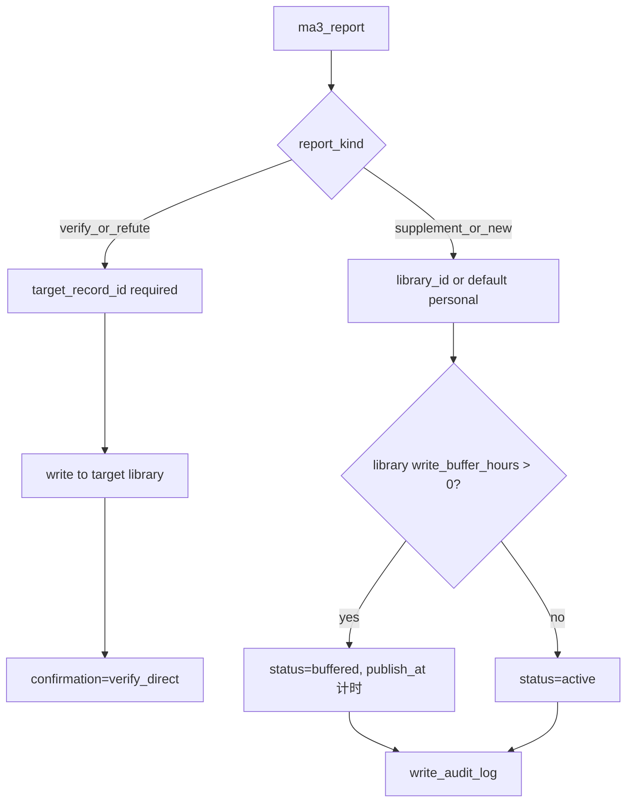

# 10 — 写入确认、审计与删除

> **ADR**：[ADR-013](../adr/013-write-confirmation-audit-delete.md)  
> **前置**：[08-kb-access](08-kb-access-and-org-isolation.md)、[09-billing](09-billing-and-quotas.md)  
> **状态**：设计定稿；`confirmation` 语义按 [13](13-self-service-onboarding.md) §10 修订（缺省不再 400）；发布时序见 [16-library-write-buffer.md](16-library-write-buffer.md)

---

## 1. 写入判定树



---

## 2. `ma3_report` 扩展字段

| 字段 | 必填 | 说明 |
|------|------|------|
| `report_kind` | 否（缺省走 new/supplement 路径） | `verify` \| `refute` \| `supplement` \| `new` |
| `target_record_id` | verify/refute 必填 | 证实/证伪对象 |
| `library_id` | supplement/new 可选 | 缺省 → 用户 personal library |
| `confirmation` | **可选，缺省 `agent_judged`** | `user_confirmed` \| `agent_judged`；verify/refute 自动 `verify_direct`。**审计元数据，不是门禁** — schema description 明示 Agent 勿为此停下向用户索要确认 |

**校验**：

```python
if report_kind in ("verify", "refute"):
    assert target_record_id
    library_id = get_record(target_record_id).library_id
    assert key_can_read(library_id)
    confirmation = "verify_direct"
else:
    confirmation = confirmation or "agent_judged"   # 缺省不 400
    library_id = library_id or default_personal_library(owner)
    assert key_can_write(library_id)
```

**响应回显 `library_selection_reason`**：

| 分支 | reason |
|------|--------|
| verify/refute 跟随 target record 所在库 | `verify_target_library` |
| payload 显式 `library_id` | `explicit_library_id` |
| DB key 缺省写 personal 库 | `default_owned_personal_library` |
| legacy/dev bypass 走 `lib_default` | `legacy_default_library` |

---

## 3. Library 命名

| 库 | 默认 name |
|----|-----------|
| personal | `{display_name} 的个人库`（`ensure_personal_library` 随显示名同步，见 [17](17-display-name-registration.md)） |
| public (`lib_default`) | `Community Library` |
| org | 创建时 admin 指定 |

`ma3_whoami` 返回 `writable_libraries[]`（含 name、visibility），Agent 可按名选库。

---

## 4. Schema

### `write_audit_log`

```sql
CREATE TABLE write_audit_log (
  id TEXT PRIMARY KEY,
  record_id TEXT NOT NULL,
  library_id TEXT NOT NULL,
  principal_id TEXT NOT NULL,
  api_key_id TEXT NOT NULL,
  report_kind TEXT NOT NULL,
  confirmation TEXT NOT NULL,
  created_at TEXT NOT NULL
);
CREATE INDEX idx_write_audit_principal ON write_audit_log (principal_id, created_at DESC);
```

- **`write_audit_log.principal_id` 是「写入者」的权威判定**（buffer owner 操作、删除权限均以此为准）；`records.created_by` 与之同步。
- `api_key_id` 是历史字符串，**不设外键**：key 被硬删后审计行保留原 id（[14](14-api-key-lifecycle.md) §3）。

### `record_deletions`（tombstone）

```sql
CREATE TABLE record_deletions (
  record_id TEXT PRIMARY KEY,
  library_id TEXT NOT NULL,
  deleted_by TEXT NOT NULL,
  deleted_at TEXT NOT NULL
);
```

### `record_relations` 扩展

| 列 | 说明 |
|----|------|
| `source_deleted` | INTEGER 0/1；target 或 source 被删时置 1 |

---

## 5. `ma3_list_my_writes`

```json
{
  "writes": [
    {
      "created_at": "2026-07-03T10:00:00Z",
      "record_id": "vk_abc",
      "library_id": "lib_default",
      "library_name": "Community Library",
      "report_kind": "new",
      "confirmation": "agent_judged",
      "status": "buffered",
      "publish_at": "2026-07-04T10:00:00Z",
      "key_prefix": "ma3k_abcd"
    }
  ]
}
```

门户对应页：`/ui/me/writes/`（[22-user-portal-ui-layout.md](22-user-portal-ui-layout.md) §3.4）。

---

## 6. `ma3_delete_record`

**权限**：`write_audit_log`（或 `records.created_by`）匹配 caller。

**分支：库是否开启 `deletion_protection`**

```python
lib = get_library(record.library_id)
if lib.deletion_protection:      # 仅 Team plan 拥有的 org 库可开启
    soft_delete(record)          # status=trashed, 移出搜索, 记 trashed_at
else:
    hard_delete(record)          # 物理移除 + tombstone
```

**硬删步骤**（默认 / Free / personal / public）：

1. 校验 owner
2. `DELETE FROM records WHERE id = ?`
3. 删索引 / embedding
4. `INSERT record_deletions`
5. `UPDATE record_relations SET source_deleted=1 WHERE target_id=? OR source_id=?`
6. **不** 删下游 records

**软删步骤**（`deletion_protection=1`）：

1. 校验 owner 或 org maintainer
2. `UPDATE records SET status='trashed', trashed_at=now WHERE id=?`
3. 移出搜索索引（保留 payload）
4. 到期（`trashed_at + retention_days`）由后台 job 转硬删

**读路径**：`lineage_warnings` 增加：

```text
record {rid} builds on {ref_id} which was deleted by owner
```

### `ma3_restore_record`（付费防误删）

- **前置**：record `status='trashed'` 且所在库 `deletion_protection=1`
- **权限**：owner 或 org maintainer
- **步骤**：`UPDATE records SET status='active', trashed_at=NULL` + 重建索引/embedding
- window 到期已硬删 → 不可恢复，返回 `already_purged`

### Schema 增量

| 对象 | 变更 |
|------|------|
| `libraries.deletion_protection` | INTEGER 0/1；仅 Team plan owned 库可置 1 |
| `libraries.retention_days` | 默认 30 |
| `records.status` | 增加 `trashed` 取值（`buffered` 见 design/16） |
| `records.trashed_at` | TEXT nullable |
| `plans.deletion_protection` | Free/Pro=0，Team=1（[09](09-billing-and-quotas.md)） |

---

## 7. MCP 工具

| 工具 | 说明 |
|------|------|
| `ma3_list_my_writes` | `limit`, `offset`；审计列表（含 status/publish_at） |
| `ma3_delete_record` | `record_id`；owner 删（默认硬删；受保护库软删）；buffered 同样可删 |
| `ma3_restore_record` | `record_id`；仅受保护库 window 内恢复 |
| `ma3_publish_record` | buffered 提前发布（见 [16](16-library-write-buffer.md)） |

---

## 8. 相关文档

- [ADR-013](../adr/013-write-confirmation-audit-delete.md)
- [08-kb-access-and-org-isolation.md](08-kb-access-and-org-isolation.md)
- [16-library-write-buffer.md](16-library-write-buffer.md)
- [13-self-service-onboarding.md](13-self-service-onboarding.md) §10
