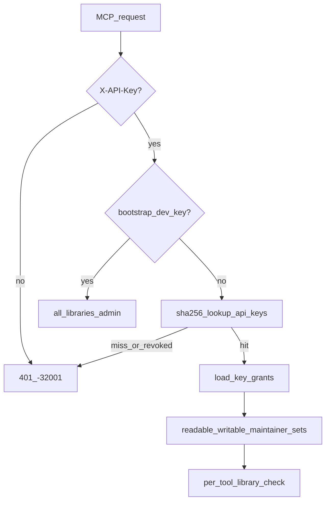

# 08 — 知识库访问与组织隔离

> **ADR**：[ADR-011](../adr/011-kb-access-and-org-isolation.md)  
> **状态**：设计定稿（2026-07-02）；实现分 6 阶段（见 §10）  
> **真源**：本文 + ADR-011；实现后更新 [`05-doc-code-mapping.md`](05-doc-code-mapping.md)

---

## 1. 目标

| 目标 | 说明 |
|------|------|
| **强制 key** | 所有 Agent 访问任何 library（含公共库）须持有效 API key |
| **贡献优先** | 对 library 无 grant = 无访问；有 grant 默认 **read + write** |
| **付费 read-only** | 仅 Pro personal 或 Team org-billed key 可创建 **只读** grant（见 [ADR-012](../adr/012-billing-and-quotas.md)） |
| **组织隔离** | org 拥有 library；成员多对多；visibility 控制 entitlement |
| **可签发 key** | Observatory（Authing）+ MCP 工具创建/管理 key |

---

## 2. 现状与差距

| 现状（代码） | 差距 |
|--------------|------|
| `resolve_from_credential` 匹配 env 列表 → 单 `library_id` + `role` | 需 DB `api_keys` + `key_grants` |
| anonymous → `{lib_default}` 可读 | 需移除匿名读 |
| `organizations` / `libraries` 无成员、无 ACL 表 | 需 `org_members`、`library_grants` |
| `visibility` 列存在但未 enforcement | 需在 entitlement 解析中使用 |
| Bearer → MCP writer | Bearer 限 Observatory；MCP 仅 `X-API-Key` |
| `ma3_report` 写死 `lib_default` | report 须指定或默认 owner 可写 grant 的 library |

---

## 3. 概念模型

### 3.1 实体

```text
Organization ──< org_members >── Principal (user:xxx)
      │
      └──< libraries (owner_org_id)
                │
                ├── visibility: public | org | private
                └── library_grants ──> Principal (外部显式授权)

Principal ──< api_keys ──< key_grants >── Library
```

### 3.2 术语

| 术语 | 含义 |
|------|------|
| **Principal** | 身份主体，如 `user:<authing_sub>`；registry 在 `principals` 表 |
| **Entitlement** | Layer 1：某 principal *被允许* 接触某 library（由 visibility + membership + library_grants 决定） |
| **Key grant** | Layer 2：某 API key 对某 library 的 **read / write / maintain** 能力子集 |
| **Public library** | `lib_default`，`visibility=public`；社区可沉淀 verified 经验 |
| **Org library** | `owner_org_id` 指向创建 org；默认 `visibility=org` |

### 3.3 双层授权

**Layer 1 — Entitlement 解析**（创建 key 或校验 grant 子集时）

```python
def entitled_libraries(principal_id: str) -> dict[str, LibraryEntitlement]:
    """
    Returns library_id -> { can_read, can_write, can_maintain }
    Union of:
      - public libraries (any authenticated principal: read+write entitlement)
      - org libraries where principal in org_members
      - library_grants rows for this principal
    Org admin on org library -> can_maintain on that library.
    """
```

**Layer 2 — Key 生效能力**（每个 MCP 请求）

```python
def effective_capabilities(key_id: str) -> KeyCapabilities:
    """
    readable = { lib | key_grants row exists }
    writable = { lib | row.can_write }
    maintainer = { lib | row.can_maintain AND owner has maintain entitlement }
    """
```

**Invariant**：`key_grants` 必须是 owner entitlement 的**子集**；`can_write=false` 仅当 key 的 `billing_account` 对应 plan 允许 RO（ADR-012 `allow_readonly_grants`）。

> **Billing 集成**：Phase 3 `entitlement_service` 调用 `billing_service.allow_readonly(billing_account_id)`；Phase B3 见 [09-billing-and-quotas.md](09-billing-and-quotas.md)。

---

## 4. 数据模型

### 4.1 扩展表

#### `organizations`（扩展）

| 列 | 类型 | 说明 |
|----|------|------|
| `id` | TEXT PK | 已有 |
| `name` | TEXT | 已有 |
| `entitlement` | TEXT | `free` \| `paid`，默认 `free` |
| `created_at` | TEXT | ISO8601 |

#### `libraries`（扩展）

| 列 | 类型 | 说明 |
|----|------|------|
| `id` | TEXT PK | 已有 |
| `org_id` | TEXT | 已有；语义 = **owner org**（与 `owner_org_id` 合并：迁移时 `owner_org_id := org_id` 若新增列则二选一，**v1 实现沿用 `org_id` 为 owner**） |
| `name` | TEXT | 已有 |
| `visibility` | TEXT | `public` \| `org` \| `private`；**必须 enforcement** |
| `created_by` | TEXT | principal_id |
| `created_at` | TEXT | ISO8601 |

**Seed**：`lib_default` → `visibility=public`，`org_id=org_default`，name=`Community Library`。

#### `principals`（扩展）

| 列 | 类型 | 说明 |
|----|------|------|
| `id` | TEXT PK | 已有 |
| `kind` | TEXT | 已有 |
| `display_name` | TEXT | 已有 |
| `created_at` | TEXT | 已有 |
| `entitlement` | TEXT | `free` \| `paid`，默认 `free` |
| `sso_user` | TEXT | Authing sub（Postgres 路径已有适配） |
| `metadata_json` | JSONB/TEXT | 已有适配 |

### 4.2 新表

#### `org_members`

```sql
CREATE TABLE org_members (
  org_id TEXT NOT NULL,
  principal_id TEXT NOT NULL,
  role TEXT NOT NULL CHECK (role IN ('admin', 'member')),
  created_at TEXT NOT NULL,
  PRIMARY KEY (org_id, principal_id)
);
CREATE INDEX idx_org_members_principal ON org_members (principal_id);
```

- 一 principal 可有多行（多 org）
- `admin`：管理 org 成员、创建 org library、改 visibility、发 library_grants

#### `api_keys`

```sql
CREATE TABLE api_keys (
  id TEXT PRIMARY KEY,
  key_hash TEXT NOT NULL UNIQUE,
  key_prefix TEXT NOT NULL,
  owner_principal_id TEXT NOT NULL,
  org_id TEXT,
  label TEXT NOT NULL DEFAULT '',
  created_at TEXT NOT NULL,
  revoked_at TEXT,
  last_used_at TEXT
);
CREATE INDEX idx_api_keys_owner ON api_keys (owner_principal_id);
CREATE INDEX idx_api_keys_hash ON api_keys (key_hash);
```

- 明文 key 仅在创建时返回一次，格式建议 `ma3k_<random>`；存储 `sha256(plaintext)`
- `key_prefix`：前 8 字符，UI 展示 `ma3k_abcd…`
- `org_id`：可选，标记 key 归属/计费上下文（如公司统一发的 key）

#### `key_grants`

```sql
CREATE TABLE key_grants (
  key_id TEXT NOT NULL,
  library_id TEXT NOT NULL,
  can_write INTEGER NOT NULL DEFAULT 1,
  can_maintain INTEGER NOT NULL DEFAULT 0,
  PRIMARY KEY (key_id, library_id)
);
```

- 行存在 ⇒ **read**
- SQLite 用 INTEGER 0/1 表示 BOOL

#### `library_grants`

```sql
CREATE TABLE library_grants (
  library_id TEXT NOT NULL,
  principal_id TEXT NOT NULL,
  role TEXT NOT NULL CHECK (role IN ('contributor', 'maintainer', 'admin')),
  created_at TEXT NOT NULL,
  PRIMARY KEY (library_id, principal_id)
);
```

- 用于 **private** library 或 org 对外部 principal 的显式授权
- `contributor` → read+write entitlement；`maintainer` / `admin` → +maintain

---

## 5. 规则详解

### 5.1 Read + Write 耦合（贡献优先）

创建或更新 `key_grants` 时：

```text
IF grant.library_id 不在 owner entitled_libraries:
    REJECT 403

IF grant.can_write == false:
    IF NOT owner_has_readonly_privilege(owner):
        FORCE can_write = true   # 或 REJECT，实现选一种；推荐 FORCE 并 audit log

owner_has_readonly_privilege(owner) :=
    principals.entitlement == 'paid'
    OR EXISTS org_members JOIN organizations
         WHERE org_members.principal_id = owner
           AND organizations.entitlement = 'paid'
```

**产品语义**：免费用户给 key 授权公共库读 ⇒ **必须同时写**；要「只读汲取」须付费或加入付费 org。

### 5.2 Visibility 与 Entitlement

| visibility | entitled principals |
|------------|---------------------|
| `public` | 所有已认证 principal（read+write；maintain 仅 platform admin / 显式 library_grants.admin） |
| `org` | `org_members` 中该 library.owner org 的成员；admin 成员 +maintain |
| `private` | 仅 `library_grants` 行 |

Org 管理员操作：

- `org` → `public`：library 进入 Layer 1 全员 entitlement（key 仍须显式 grant）
- 对 `user:external` 插入 `library_grants(contributor|maintainer)`

### 5.3 Maintain 能力

`key_grants.can_maintain=true` 要求：

1. `can_write=true`
2. Owner 对该 library 有 maintain entitlement（org admin on org library，或 `library_grants.role ∈ {maintainer, admin}`）

用于 `ma3_list_drafts`、`ma3_review_record`、`supersedes` 等现有 maintainer 门控。

### 5.4 MCP 请求解析



- **Bootstrap dev key**：`MA3_DEV_AUTH=1` 且匹配 `MA3_DEV_API_KEY` → 保持现有 admin bypass（LAN only）
- **Bearer on MCP**：不再授予数据访问；若仅 Bearer 无 key → 401

### 5.5 写路径 library 选择

`ma3_report` 扩展（Phase 2）：

- 新增可选 `library_id`（或 `target_library`）；缺省 = owner 的 **唯一** writable grant library，若多个则 **400 要求显式指定**
- 校验 `library_id ∈ auth.writable_library_ids`

---

## 6. Key 管理界面

### 6.1 Observatory（Authing session）

| 页面 | 能力 |
|------|------|
| `/ui/keys/` | 列表：prefix、label、grants 摘要、created、revoked |
| `/ui/keys/new` | 创建：label、选 libraries、每 library 写开关（只读 entitlement 未满足则写开关 disabled 且强制 on） |
| `/ui/orgs/` | 所属 org 列表、角色 |
| `/ui/orgs/{id}/libraries` | org admin：建 library、改 visibility、成员管理 |

API routes（`routes_auth.py` 或新 `routes_keys.py`）：

- `POST /api/keys` — 创建，返回 plaintext **一次**
- `GET /api/keys` — 列表
- `DELETE /api/keys/{id}` — 撤销（设 `revoked_at`）
- `PATCH /api/keys/{id}/grants` — 更新 grants（同 entitlement 规则）

### 6.2 MCP 工具

| 工具 | 说明 |
|------|------|
| `ma3_create_key` | `label`, `grants[]`, 可选 `org_id`；返回 plaintext key **一次** |
| `ma3_list_keys` | 列出 owner 的 keys（不含 hash） |
| `ma3_revoke_key` | `key_id` |

鉴权：调用者 key 的 owner 必须是同一 principal，或 admin bypass。新 key 的 grants ⊆ 调用者 entitlement。

### 6.3 `ma3_whoami` 扩展

返回增加：

```json
{
  "principal_id": "user:abc",
  "entitlement": "free",
  "orgs": [{"org_id": "org_x", "role": "member", "org_entitlement": "paid"}],
  "key": {"id": "key_...", "prefix": "ma3k_abcd", "grants": [...]},
  "effective": {"readable": ["lib_default"], "writable": ["lib_default"], "maintainer": []}
}
```

---

## 7. `ma3_doctor` 与迁移

- `doctor` 报告：`anonymous_mcp_enabled: false`、`api_keys_table: ok`、`legacy_env_writer_keys: deprecated`
- 环境变量：`MA3_WRITER_API_KEYS` / `MA3_MAINTAINER_API_KEYS` 标记 deprecated；日志 warn if set

---

## 8. 安全

| 项 | 措施 |
|----|------|
| Key 存储 | 仅 SHA-256 hash；明文不落库 |
| Key 传输 | HTTPS；`X-API-Key` header |
| 撤销 | `revoked_at` 非空即拒绝 |
| 审计 | 创建/撤销/grant 变更写 application log（v1）；`review_note` 审计表仍属 P2+ |
| Org 外部 grant | target principal 须已存在（至少登录过一次 Authing） |

---

## 9. 与 Pitch 对齐

- **公共 verified 经验**：`lib_default` public，但须 key + 显式 grant + 默认 read-write → 鼓励写回
- **组织内部**：org library + private visibility；公网搜不到 → 只能靠 ma3 积累（见 knowledge-management-pitch §关于组织内部知识）
- **Agent 不会自己沉淀**：policy 仍强制 `ma3_report`；key 模型保证有写能力 unless 付费只读

---

## 10. 分阶段实现

### Phase 1 — Schema & migration

**目标**：表结构就绪；seed public library；无行为变更。

**任务**：

1. `db.py` `initialize_database()` 增加表/列（§4）
2. Migration script `scripts/migrate_kb_acl_v1.py`：
   - `ALTER` organizations / libraries / principals
   - 创建 org_members, api_keys, key_grants, library_grants
   - `UPDATE libraries SET visibility='public' WHERE id='lib_default'`
3. `get_system_stats` / Observatory 展示 org 成员数、key 数（可选）

**验收**：migration 在 SQLite + Postgres 可重复执行；现有测试仍绿（行为未改）。

**映射文件**：`app/storage/db.py`

---

### Phase 2 — DB-backed auth resolution

**目标**：MCP 数据路径仅认 DB key + dev bypass；移除 anonymous 读。

**任务**：

1. 新模块 `app/services/api_key_service.py`：
   - `hash_key(plaintext) -> str`
   - `resolve_api_key(plaintext) -> ApiKeyRecord | None`
   - `load_key_capabilities(key_id) -> KeyCapabilities`
2. 重构 `app/core/security.py`：
   - `ResolvedPrincipal` 增加 `key_id`, `readable_library_ids`, `writable_library_ids`, `maintainer_library_ids`（或嵌套 `KeyCapabilities`）
   - `resolve_from_credential`：API key → DB lookup；移除 writer/maintainer env 列表匹配（Phase 6 删 env）
   - `McpAuthContext.readable_library_ids` 等改为读 principal 上的集合
   - anonymous **不再**返回 default library；无 key → `invalid_credentials`
3. `routes_mcp.py` / `_handle_rpc`：无有效 key 时数据工具 401
4. `mcp_tool_service.py`：`ma3_report` 支持 `library_id` 参数；校验 writable set
5. Bearer 路径：MCP 不再调用 `_resolve_authing_bearer`（保留代码供 Observatory）

**验收**：

- 无 key 调用 `ma3_context` → 401
- 插入 test key + grant 后可读写的 integration test
- dev bypass 仍可用

**映射文件**：`security.py`, `api_key_service.py`, `mcp_tool_service.py`, `models/mcp_payloads.py`

---

### Phase 3 — Entitlement & read/write coupling

**目标**：创建 key/grant 时 enforcement 贡献优先 + 付费 read-only。

**任务**：

1. `app/services/entitlement_service.py`：
   - `entitled_libraries(principal_id)`
   - `allow_readonly_grants(billing_account_id)` — 委托 `billing_service`（ADR-012）
   - `validate_key_grants(owner_id, grants[], billing_account_id)`
2. Observatory `POST /api/keys` 与 `ma3_create_key` 调用 validate；创建 key 时 **必选 billing_account**
3. UI：写开关 disabled + tooltip 当 plan 不允许 RO

**验收**：

- free plan 创建 public grant → `can_write` 强制 true
- pro/team billing_account 可创建 `can_write=false` grant
- grant 超出 entitlement → 403

**映射文件**：`entitlement_service.py`, `billing_service.py`, `routes_keys.py`, MCP payloads

---

### Phase 4 — Organization & libraries

**目标**：org 成员、org library 生命周期、visibility enforcement。

**任务**：

1. `app/services/org_service.py`：
   - `create_org`, `add_member`, `remove_member`, `list_orgs_for_principal`
   - `create_library(org_id, visibility, name)` — admin only
   - `set_library_visibility`, `grant_external_principal`
2. Entitlement  resolver 接入 visibility + org_members + library_grants
3. Observatory org 管理页（最小 CRUD）
4. MCP（可选 Phase 5）：`ma3_create_library` org admin only

**验收**：

- org A 的 library 对 org B 成员不可 entitlement（除非 public 或 explicit grant）
- org admin 可将 library 设为 public
- 成员多 org 场景 entitlement 并集正确

**映射文件**：`org_service.py`, `entitlement_service.py`, `routes_ui.py`

---

### Phase 5 — Key management UI & MCP tools

**目标**：用户可自助签发 key；Agent 可编程创建 key。

**任务**：

1. Observatory `/ui/keys/*` + REST（§6.1）
2. MCP：`ma3_create_key`, `ma3_list_keys`, `ma3_revoke_key` + Pydantic payloads + `ma3_validate` 注册
3. `ma3_whoami` 扩展（§6.3）
4. Client manifest / policy 提及新工具（若需）

**验收**：

- Authing 登录用户可在 UI 创建 key 并使用 MCP
- Agent 用 parent key 创建 child key，grants ⊆ parent entitlement
- plaintext 仅创建响应出现一次

**映射文件**：`routes_keys.py`, `routes_ui.py`, `mcp_tool_service.py`, `mcp_payloads.py`

---

### Phase 6 — Tests, migration, deprecation

**目标**：质量门禁；旧 env key 迁移路径；文档更新。

**任务**：

1. **Tests**：
   - `tests/unit/test_entitlement.py` — visibility, coupling, paid flag
   - `tests/unit/test_api_key_auth.py` — hash, revoke, capabilities
   - `tests/integration/test_kb_acl_integration.py` — 无 key 401、跨 org 隔离、public grant
2. **Migration 工具**：`scripts/import_env_keys.py` — 将 `MA3_WRITER_API_KEYS` 等导入为 DB keys（一次性，绑定 `dev:import` principal 或指定 owner）
3. **Deprecation**：config 保留读取但 startup warn；文档删除 writer/maintainer env 推荐
4. 更新 [`05-doc-code-mapping.md`](05-doc-code-mapping.md)、[`07-kb-read-write-review.md`](07-kb-read-write-review.md)、deploy profile 文档
5. 现有 `test_mcp_integration.py`：所有用例带 isolated DB key fixture

**验收**：全 suite 绿；doctor 报告 legacy keys deprecated。

---

## 11. 开放问题（v1.1+）

| 项 | 说明 |
|----|------|
| ~~Stripe / 发票~~ | 见 [ADR-012](../adr/012-billing-and-quotas.md) + [09-billing-and-quotas.md](09-billing-and-quotas.md) |
| `entitlement` 字段 | 迁移为 `billing_account.plan_code` 的兼容投影 |
| Key 轮换 / 过期 | `expires_at` 列 |
| Platform admin UI | 手工改 plan_code（Phase B4） |
| `ma3_create_library` MCP | org admin 自助建库 |

---

## 12. 相关文档

| 文档 | 关系 |
|------|------|
| [ADR-011](../adr/011-kb-access-and-org-isolation.md) | 访问控制决策 |
| [ADR-012](../adr/012-billing-and-quotas.md) | 付费套餐与配额 |
| [ADR-013](../adr/013-write-confirmation-audit-delete.md) | 写入确认、审计、硬删除 |
| [10-write-audit-and-delete.md](10-write-audit-and-delete.md) | report_kind、ma3_list_my_writes、ma3_delete_record |
| [09-billing-and-quotas.md](09-billing-and-quotas.md) | Billing schema、metering、enforcement |
| [04-target-architecture-draft.md](04-target-architecture-draft.md) | 模块划分 |
| [pitch/knowledge-management-pitch.md](../pitch/knowledge-management-pitch.md) | 产品叙事 |
| [pitch/kb-access-and-team-pitch.md](../pitch/kb-access-and-team-pitch.md) | 团队与付费叙事 |
| [07-kb-read-write-review.md](07-kb-read-write-review.md) | 读写能力基线 |
